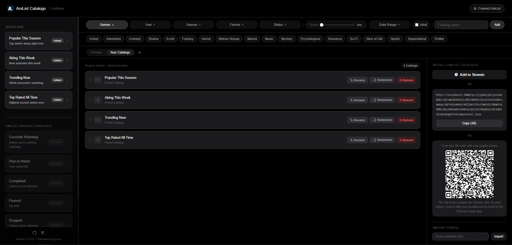

# AniList Catalogs

A self-hosted [Stremio](https://www.stremio.com/) add-on that brings your AniList library and discovery catalogs directly into Stremio. Built with FastAPI, powered by the AniList GraphQL API.

---

## Features

- **Discovery catalogs** — Popular This Season, Airing This Week, Trending Now, Top Rated All Time
- **Custom catalogs** — build your own by filtering genre, format, season, year, status, and minimum score
- **Account catalogs** — Currently Watching, Plan to Watch, Completed, Paused, Dropped, Rewatching, My Favourites (requires AniList login)
- **No database, no accounts on the server** — configuration lives entirely in the manifest URL (see [How it works](#how-it-works))
- **AniList OAuth** — connect your AniList account to unlock personal list catalogs
- **Encrypted tokens** — your AniList access token is AES-encrypted before being embedded in the URL
- **QR code install** — scan to install directly on mobile Stremio
- **Drag-to-reorder catalogs**, rename, randomize
- **Grid, Detail, and List preview views** in the config UI

---

## Screenshots



---

## How it works

AniList Catalogs uses a **config-in-URL** approach — there is no database and no server-side user state.

When you configure your catalogs in the web UI, the page encodes your preferences (catalog list, filters, optional encrypted AniList token) as a compact base64 JSON string. That string becomes part of the manifest URL you install in Stremio:

```
https://your-server.com/eyJjIjpbeyJpIjoiYW5pbGlzdC10cmVuZGluZyJ9XX0/manifest.json
```

Stremio stores this URL. Every time it needs catalog data it calls that URL, the server decodes the config, and serves the right results. No login, no session, no database — the config travels with the link.

If you log in with AniList, your encrypted access token is appended to the config in the URL. **Keep that URL private — treat it like a password.**

---

## Prerequisites

- [Docker](https://docs.docker.com/get-docker/) and Docker Compose
- An AniList developer application — only required if you want account catalogs (Currently Watching, etc.)

---

## Setup

### 1. Clone the repository

```bash
git clone https://github.com/juuzocyber/anilist-catalogs.git
cd anilist-catalogs
```

### 2. Create your `.env` file

```bash
cp .env.example .env
```

Open `.env` in an editor. The only value you **must** set before starting is `SECRET_KEY` — it's used to encrypt AniList tokens. Generate a secure one with:

```bash
docker run --rm python:3.12-slim python -c "import secrets; print(secrets.token_hex(32))"
```

Paste the output as the value for `SECRET_KEY`. Leave the `ANILIST_*` variables empty for now if you're not setting up OAuth yet.

### 3. Start the container

```bash
docker compose up -d
```

Docker will build the image on first run. Once it's up, open [http://localhost:7000/configure](http://localhost:7000/configure) to access the configuration UI.

### 4. Install in Stremio

Configure your catalogs in the UI, then either:
- Click **Add to Stremio** to deep-link directly into the app
- Copy the manifest URL and paste it into Stremio manually
- Scan the QR code on your phone

---

## AniList OAuth Setup

To use account catalogs you need to register a developer client with AniList so the add-on can request access on a user's behalf.

1. Go to [anilist.co/settings/developer](https://anilist.co/settings/developer) and click **Create new client**
2. Set the **Redirect URI** to match your deployment — for example:
   - `http://localhost:7000/oauth/callback` if running locally
   - `https://your-domain.com/oauth/callback` if running behind a reverse proxy
3. Copy the **Client ID** and **Client Secret** into your `.env`:

```env
ANILIST_CLIENT_ID=12345
ANILIST_CLIENT_SECRET=your_client_secret
ANILIST_REDIRECT_URI=http://localhost:7000/oauth/callback
```

4. Restart the container to pick up the new values:

```bash
docker compose down && docker compose up -d
```

Once configured, a **Connect AniList** button will appear in the top-right of the configure page.

---

## Managing the container

```bash
docker compose logs -f                        # stream logs
docker compose ps                             # check status and health
docker compose down                           # stop and remove the container
docker compose pull && docker compose up -d   # pull a fresh build and restart
```

The container restarts automatically unless you explicitly stop it (`restart: unless-stopped`). A health check hits `GET /health` every 30 seconds — if it fails three times in a row Docker will mark the container unhealthy.

---

## Environment Variables

All configuration is read from `.env` at startup. See `.env.example` for the full template — **never commit `.env` to version control**.

| Variable | Description | Required | Example |
|---|---|---|---|
| `HOST` | Host address the server binds to | Optional | `0.0.0.0` |
| `PORT` | Port the server listens on | Optional | `7000` |
| `SECRET_KEY` | Derives the encryption key for AniList tokens. Generate with `secrets.token_hex(32)` | **Required** | `a3f8c2d91e4b...` |
| `ANILIST_CLIENT_ID` | Client ID from your AniList developer application | Required for OAuth | `12345` |
| `ANILIST_CLIENT_SECRET` | Client Secret from your AniList developer application | Required for OAuth | `abc123xyz...` |
| `ANILIST_REDIRECT_URI` | OAuth callback URL — must exactly match what is registered in AniList developer settings | Required for OAuth | `http://localhost:7000/oauth/callback` |

---

## Security Notes

**Keep your manifest URL private if it contains an AniList token.**
When you connect your AniList account, your encrypted access token is embedded in the manifest URL. Anyone with that URL can install your personal list catalogs. Treat it like a password and do not share it.

**Never commit `.env` to version control.**
`.env` is listed in `.gitignore` and the pre-commit hook will block commits that contain secret-like values. If you accidentally commit a secret, rotate it immediately and consider the old value compromised.

**Rotate `SECRET_KEY` if compromised.**
Changing `SECRET_KEY` invalidates all existing encrypted tokens — manifest URLs containing an AniList token will stop working until users reconnect their account. This is intentional and is the correct response to a key compromise.

**`ANILIST_CLIENT_SECRET` is a server-side secret.**
It is never sent to the browser and is only used in the server-to-server token exchange at `/oauth/callback`.

---

## Disclaimer

This project is not affiliated with, endorsed by, or connected to AniList. All anime data is provided by the [AniList API](https://anilist.gitbook.io/anilist-apiv2-docs/).

---

## License

MIT — see [LICENSE](LICENSE).
