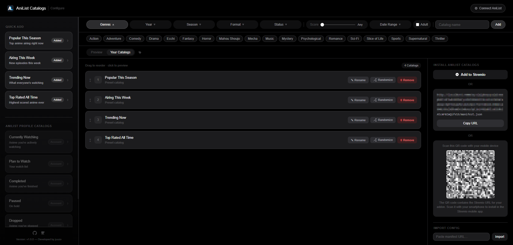
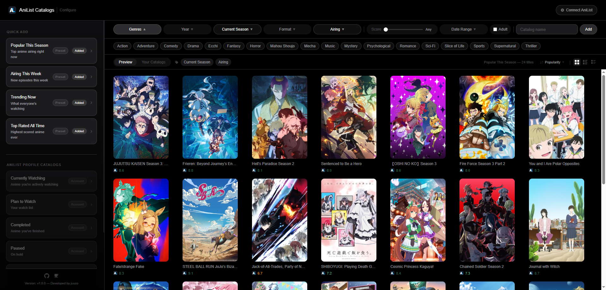

# AniList Catalogs

A self-hosted [Stremio](https://www.stremio.com/) add-on that brings your AniList library and discovery catalogs directly into Stremio. Built with FastAPI, powered by the AniList GraphQL API.

---

## Features

- **Discovery catalogs** — Popular This Season, Airing This Week, Trending Now, Top Rated All Time
- **Custom catalogs** — build your own by filtering genre, format, season, year, status, and minimum score
- **Account catalogs** — Currently Watching, Plan to Watch, Completed, Paused, Dropped, Rewatching, My Favourites (requires AniList login)
- **Smart Rows / AI Recommendations** — personalised title-search catalogs generated from your watch history, seed anime, top ratings, or hidden-gem preferences via any OpenRouter-compatible model (requires AniList login + OpenRouter API key)
- **Recipes** — share and import public catalog bundles without leaking AniList or OpenRouter auth state
- **Poster Styles** — optional rank/rating poster overlays served through a separate Stremio manifest variant
- **Fribb + Kitsu ID mapping** — AniList entries are mapped to IMDb/TMDB where possible, with sequel-to-S1 replacement for better Stremio/Fusion compatibility
- **Stateless config + durable auth** — catalog configuration lives in the manifest URL; encrypted AniList/OpenRouter auth lives in a local SQLite store
- **AniList OAuth** — connect your AniList account to unlock personal list and AI catalogs
- **Encrypted tokens** — AniList access tokens and OpenRouter API keys are AES-encrypted at rest; neither ever appears in the manifest URL or any log
- **QR code install** — scan to install directly on mobile Stremio
- **Drag-to-reorder catalogs**, rename, randomize, title search, and source-backed custom catalogs
- **Grid, Detail, and List preview views** in the config UI
- **Public-launch hardening** — fragment-based OAuth handoff, route-scoped CORS, CSP on the configure page, vendored QR runtime, and legacy embedded-token auth URLs disabled
- **Strict CSP-safe configure UI** — the config page now runs under a strict nonce-based CSP without `'unsafe-inline'`, using self-hosted assets plus class/data-attribute driven JS instead of inline handlers/styles

---

## Screenshots





---

## How it works

AniList Catalogs is built around two modes with different state models.

### Without an AniList account (fully stateless)

There is no database or user account system involved for public catalogs. When you configure your catalogs in the web UI, the page encodes your preferences (catalog list, filters) as a compact gzip-compressed base64 JSON string. That string becomes the entire manifest URL you install in Stremio:

```
https://your-server.com/eyJjIjpbeyJpIjoiYW5pbGlzdC10cmVuZGluZyJ9XX0/manifest.json
```

Stremio stores this URL. Every time it needs catalog data it calls that URL, the server decodes the config, and serves the right results. No login is required for public catalogs — the config travels with the link.

### With an AniList account

When you connect your AniList account, the server stores your encrypted access token in a local SQLite auth database. This durable auth record powers the live list preview, user avatar, account catalogs, and AI recommendations across restarts.

The manifest URL you install in Stremio uses a short auth key (22 URL-safe characters) appended to the config token as `{config}~{session_key}`. The actual encrypted token lives server-side only. This means:

- **Server restarts do not invalidate authenticated installs** as long as the SQLite auth database is preserved.
- **Authenticated URLs stay valid until you explicitly disconnect AniList** or lose the auth database.
- **Older authenticated installs created before the durable auth change may need one reconnect/reinstall** if their data only ever lived in the old in-memory cache.

**Keep your manifest URL private — the auth key in it grants access to your AniList list data.**

### With Smart Rows / AI Recommendations

Smart Rows use [OpenRouter](https://openrouter.ai) to generate personalised catalogs from your AniList history. A row can be based on your overall taste, one seed anime, your highest-rated completed shows, or hidden-gem preferences. To enable it:

1. Connect your AniList account (required — the AI uses your watch history as input)
2. Get a free API key from [openrouter.ai/keys](https://openrouter.ai/keys)
3. Open the **Smart Rows** settings gear in the configure UI
4. Paste your key and click **Test** to verify it, then **Save**
5. Use **Build Smart Row** to preview and save an AI-powered catalog

Your OpenRouter key is encrypted with the same Fernet cipher as your AniList token and stored server-side only in the same SQLite auth record — it never appears in the manifest URL, any API response, or any log. It is cleared when you disconnect your AniList account.

AI catalog results are cached for one hour per auth key, model, and Smart Row configuration. The server sends a compact watch-history prompt to the selected model and asks for a JSON array of anime title strings, not AniList IDs. Those titles are batch-resolved through AniList search, filtered against the user's existing lists, and supplemented from AniList's recommendation graph if the model returns too few usable matches.

### Poster Styles

Poster Styles are an optional manifest variant for people who want more visual context in Stremio. When enabled, the install URL uses `/poster-lab/manifest.json` and catalog poster URLs point at the local `/poster-lab/render.png` renderer.

The renderer fetches only allowlisted AniList poster image hosts, draws rank and/or rating banners with Pillow, and returns cacheable PNGs. The standard manifest remains available without poster overlays.

### Recipes and Search

Recipes let you copy or import public catalog bundles through a `configure?recipe=...` link. Recipes deliberately omit account catalogs, Smart Rows, and auth keys, so they are safe to share as public discovery presets.

The configure UI also includes AniList title search. Search results can seed Smart Rows, be included in a source-backed custom catalog, or be used to create a filtered copy of an existing catalog.

### ID Mapping and Metadata

AniList IDs are not ideal for downstream Stremio/Fusion metadata and streaming add-ons, so the server tries to resolve every entry to a better external ID before serving it:

- **Preferred order:** `tt*` (IMDb) → `tmdb:*` → `anilist:*` fallback
- **Primary source:** Fribb's anime mapping dataset
- **Supplementary source:** a free Kitsu→IMDb mapping used only when Fribb already matched the anime but still has no IMDb/TMDB ID
- **Sequels:** where Fribb can trace a sequel back to season 1, the catalog swaps the sequel entry for the base S1 anime so Stremio/Fusion metadata behaves more consistently

This is why some catalogs intentionally return the season-one show instead of a later AniList sequel entry.

---

## Prerequisites

- [Docker](https://docs.docker.com/get-docker/) and Docker Compose
- An AniList developer application — only required if you want account catalogs (Currently Watching, etc.)

---

## Setup

### 1. Clone the repository

```bash
git clone https://github.com/juuzocyber/anilist-catalogs.git
cd anilist-catalogs
```

### 2. Create your `.env` file

```bash
cp .env.example .env
```

Open `.env` in an editor. The only value you **must** set before starting is `SECRET_KEY` — it's used to encrypt AniList tokens. Generate a secure one with:

```bash
docker run --rm python:3.12-slim python -c "import secrets; print(secrets.token_hex(32))"
```

Paste the output as the value for `SECRET_KEY`. Leave the `ANILIST_*` variables empty for now if you're not setting up OAuth yet.

The default durable auth database path is `data/auth.db`. If you use Docker, the bundled `docker-compose.yml` mounts `/app/data` as a named volume so authenticated installs survive container recreation.

### 3. Start the container

```bash
docker compose up -d
```

Docker will build the image on first run. Once it's up, open [http://localhost:7000/configure](http://localhost:7000/configure) to access the configuration UI.

### 4. Install in Stremio

Configure your catalogs in the UI, then either:

- Click **Add to Stremio** to deep-link directly into the app
- Copy the manifest URL and paste it into Stremio manually
- Scan the QR code on your phone

---

## AniList OAuth Setup

To use account catalogs you need to register a developer client with AniList so the add-on can request access on a user's behalf.

1. Go to [anilist.co/settings/developer](https://anilist.co/settings/developer) and click **Create new client**
2. Set the **Redirect URI** to match your deployment — for example:
   - `http://localhost:7000/oauth/callback` if running locally
   - `https://your-domain.com/oauth/callback` if running behind a reverse proxy
3. Copy the **Client ID** and **Client Secret** into your `.env`:

```env
ANILIST_CLIENT_ID=12345
ANILIST_CLIENT_SECRET=your_client_secret
ANILIST_REDIRECT_URI=http://localhost:7000/oauth/callback
```

4. Restart the container to pick up the new values:

```bash
docker compose down && docker compose up -d
```

Once configured, a **Connect AniList** button will appear in the top-right of the configure page.

For public deployments, use an HTTPS redirect URI. The OAuth flow hands the auth key back to the configure page via a URL fragment (`#s=...`) instead of a query string, which keeps it out of server logs and normal referrer leakage paths.

---

## Managing the container

```bash
docker compose logs -f                        # stream logs
docker compose ps                             # check status and health
docker compose down                           # stop and remove the container
docker compose pull && docker compose up -d   # pull a fresh build and restart
```

The container restarts automatically unless you explicitly stop it (`restart: unless-stopped`). A health check hits `GET /health` every 30 seconds — if it fails three times in a row Docker will mark the container unhealthy.

---

## Public Hosting Notes

If you plan to expose the add-on publicly:

- Use HTTPS end-to-end and register an HTTPS `ANILIST_REDIRECT_URI`
- Keep FastAPI docs disabled unless you explicitly need them (`ENABLE_API_DOCS=1`)
- Put normal reverse-proxy rate limiting in front of the app as a second line of defense
- Remember that authenticated manifest URLs are private because they contain a durable auth key in the path

The app itself now helps here by:

- using fragment-based OAuth return (`/configure#s=...`) instead of query-string session handoff
- sending browser-only routes without permissive CORS
- sending addon routes with `Access-Control-Allow-Origin: *` so Stremio/Fusion can still consume them
- serving the configure page with a strict nonce-based CSP and other hardening headers
- serving only allowlisted local static assets required by the configure UI
- bounding API request bodies and validating auth keys, OpenRouter keys, model names, and Smart Row payload sizes
- using raw ASGI paths for route-scoped security decisions instead of Host-derived URL helpers
- allowing Poster Style rendering only from AniList poster image hosts
- rejecting legacy embedded-token auth manifests for account/AI catalogs

---

## Environment Variables

All configuration is read from `.env` at startup. See `.env.example` for the full template — **never commit `.env` to version control**.

| Variable                | Description                                                                                                                                         | Required           | Example                                |
| ----------------------- | --------------------------------------------------------------------------------------------------------------------------------------------------- | ------------------ | -------------------------------------- |
| `HOST`                  | Host address the server binds to                                                                                                                    | Optional           | `0.0.0.0`                              |
| `PORT`                  | Port the server listens on                                                                                                                          | Optional           | `7000`                                 |
| `SECRET_KEY`            | Derives the encryption key for AniList tokens and OpenRouter keys. Generate with `secrets.token_hex(32)`                                            | **Required**       | `a3f8c2d91e4b...`                      |
| `ANILIST_CLIENT_ID`     | Client ID from your AniList developer application                                                                                                   | Required for OAuth | `12345`                                |
| `ANILIST_CLIENT_SECRET` | Client Secret from your AniList developer application                                                                                               | Required for OAuth | `abc123xyz...`                         |
| `ANILIST_REDIRECT_URI`  | OAuth callback URL — must exactly match what is registered in AniList developer settings                                                            | Required for OAuth | `http://localhost:7000/oauth/callback` |
| `OPENROUTER_API_KEY`    | Reserved for a future server-side default. Users supply their own key via the configure UI; it is stored encrypted in the auth store, never here   | Optional           | `sk-or-v1-...`                         |
| `AUTH_DB_PATH`          | SQLite path for encrypted AniList/OpenRouter auth state. Keep it on persistent storage in production                                                | Optional           | `data/auth.db`                         |
| `ENABLE_API_DOCS`       | Enables FastAPI `/docs`, `/redoc`, and `/openapi.json`. Leave off for public deployments                                                            | Optional           | `1`                                    |

---

## Security Notes

**Keep your manifest URL private.**
Anyone with your manifest URL can install your personal list catalogs and use your auth key to read your AniList lists. Do not share it publicly.

**Old embedded-token manifest URLs are no longer supported.**
If you still have a very old authenticated install URL from before the current session-key design, reconnect AniList and reinstall the addon to get a current manifest URL.

**Never commit `.env` to version control.**
`.env`, local SQLite databases, and server logs are listed in `.gitignore`. Still review `git status --short` before every commit and use secret scanning if available. If you accidentally commit a secret, rotate it immediately and consider the old value compromised.

**Rotate `SECRET_KEY` if compromised.**
Changing `SECRET_KEY` invalidates all existing encrypted session data — everyone will need to reconnect their AniList account and re-enter their OpenRouter key. This is intentional and is the correct response to a key compromise.

**Preserve `AUTH_DB_PATH` if you want durable authenticated installs.**
If the SQLite auth database is deleted or replaced, authenticated manifest URLs stop working until users reconnect AniList. The included Docker volume is there to prevent that.

**Do not publish your local auth database or logs.**
The default `data/auth.db` stores encrypted AniList and OpenRouter secrets. The ciphertext still belongs to your deployment, and logs may contain private manifest URLs or auth keys from local testing.

**`ANILIST_CLIENT_SECRET` is a server-side secret.**
It is never sent to the browser and is only used in the server-to-server token exchange at `/oauth/callback`.

**Your OpenRouter API key is encrypted at rest.**
The key you enter in the configure UI is encrypted with Fernet (AES-128-CBC + HMAC-SHA256) using the same `SECRET_KEY` before being written to the server's auth store. It is never returned in any API response, never written to any log, and never included in the manifest URL. It is cleared when you disconnect your AniList account.

**The configure page is hardened for public hosting.**
Runtime QR generation is served from a vendored local script instead of a CDN. `/configure` is sent with a Content Security Policy, `Referrer-Policy: no-referrer`, `X-Content-Type-Options: nosniff`, and frame-blocking headers. Browser-only routes do not expose permissive CORS; only addon protocol routes (`manifest`, `catalog`, `meta`) send `Access-Control-Allow-Origin: *`.

**The configure page now uses a strict nonce-based CSP.**
The UI no longer depends on inline `onclick` handlers or runtime `style=""` attributes. That means the same hardened CSP works on both `localhost` and HTTPS deployments without falling back to `'unsafe-inline'`.

**Static assets are allowlisted.**
The app serves the vendored QR script and font at their existing `/static/...` URLs, but unknown static paths return 404 instead of exposing a general static file server.

**API docs are disabled by default.**
`/docs`, `/redoc`, and `/openapi.json` stay off unless you explicitly enable them with `ENABLE_API_DOCS=1`.

---

## Disclaimer

This project is not affiliated with, endorsed by, or connected to AniList. All anime data is provided by the [AniList API](https://anilist.gitbook.io/anilist-apiv2-docs/).

---

## License

MIT — see [LICENSE](LICENSE).
